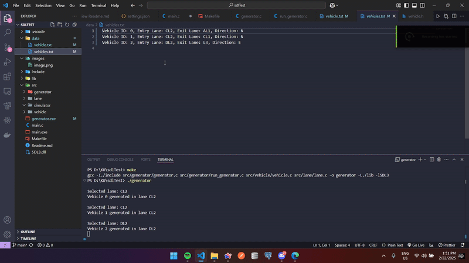
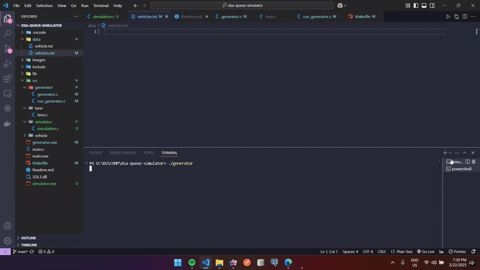
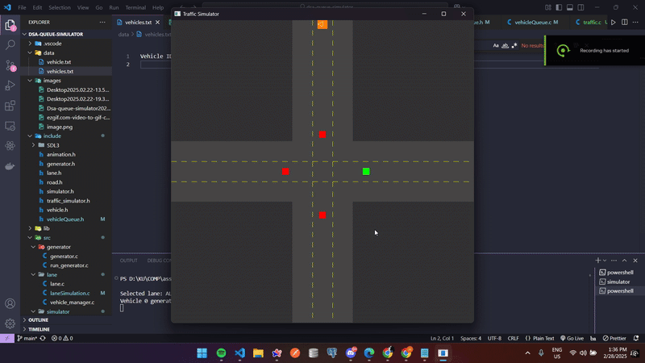

# DSA Queue Simulator 🚦

This project is a **Traffic Light Simulation** using **SDL3**.  
It simulates vehicles **queuing** and **dequeueing** based on traffic light changes which has priority lane **AL2**

### Features:

- **Traffic Light System** (changes every few seconds)
- **Vehicle Queue** (randomly generated & dequeued on green light)
- **Intersection with 3-Lane Roads**

🚗💨 Built with **C** and **SDL3**.

The Generator works properly:



The Data is Successfully parsed in simulator side



Simulation:
It works upto the switching of lanes, dequeue implementation and lights remaining:



## Description

### **Vehicle Generator:**

The vehicle generator continuously runs and generates vehicle data. It assigns a vehicle a unique ID, entry lane, exit lane, direction, and movement state. The data for each vehicle is written into a file (e.g., `AL2.txt`).

**Entry lanes**: L1 (incoming lanes), L2 (outgoing lanes with traffic control).

**Exit lanes**: L3 (outgoing lanes).

**Direction**: North (N), East (E), South (S), or West (W).

The generator simulates the behavior of vehicles by randomly selecting entry and exit lanes, speed, and direction, and writes the data to a file.

### **Traffic Simulator:**

The traffic simulator reads the vehicle data from the file(s) generated by the generator and simulates the movement of the vehicles through the lanes. It processes the vehicles, moving them from one lane to another according to predefined traffic rules.

#### Lane Movement Rules:

- **L3 lanes** always go to their left lanes:

  - AL1 → BL3
  - BL3 → CL1
  - CL1 → DL3
  - DL3 → AL1

- **L2 lanes** can either go straight or turn right:
  - AL2 → CL1 or DL1
  - BL2 → AL1 or DL1
  - CL2 → AL2 or BL1

## Data Exchange Between Generator and Simulator

- The **generator** writes the vehicle data to a file **(./data/vehicles.txt)**, which is continually updated as new vehicles are generated.
- The **simulator** reads the file and processes the vehicle data line by line.
- The **vehicle data format** written to the file is as follows:
  ````json
  Vehicle ID: 2, Entry Lane: DL2, Exit Lane: CL1, Direction: W```
  ````

## How to run this Project

1. Clone this github repo

```bash
git clone https://github.com/Githeimer/dsa-queue-simulator.git
```

Make sure **make** command works on your local machine

2. Steps to run the program

Initially clear the data from **(./data/vehicles.txt)**

then run:

```bash
make
```

after open a terminal and paste this:

```bash
./simulator
```

then open another terminal and paste this:

```bash
./generator
```

This will help you run the program.
