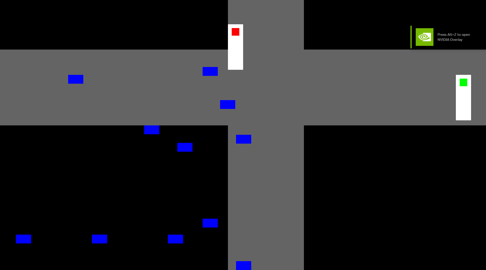

# DSA Queue Simulator 🚦

This project is a **Traffic Light Simulation** using **SDL3**.  
It simulates vehicles **queuing** and **dequeueing** based on traffic light changes.

### Features:

- **Traffic Light System** (changes every few seconds)
- **Vehicle Queue** (randomly generated & dequeued on green light)
- **Intersection with 3-Lane Roads**
- **Basic Road & Zebra Crossing Rendering**

🚗💨 Built with **C** and **SDL3**.

Currently It's trash as you can see:

I'm working on it
